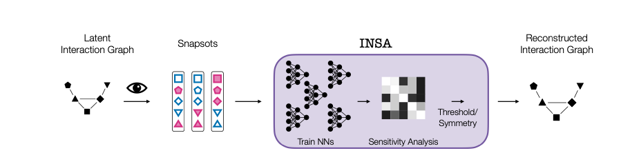
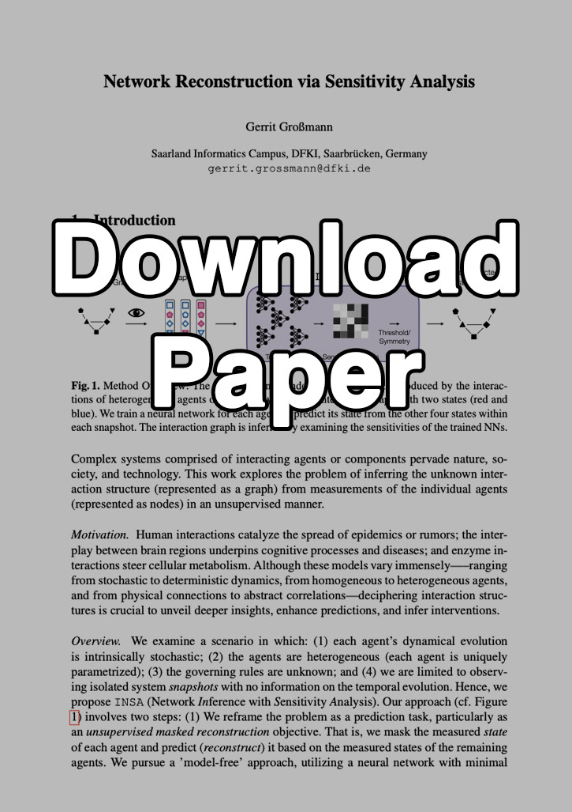

# INSA



This repository provides a proof-of-concept implementation for the manuscript _[Network Reconstruction via Sensitivity Analysis](https://github.com/gerritgr/Insa/blob/b1e937da1811af52319ba0f3bc0e53862e891228/manuscript.pdf)_.

## Poster and Paper
[](poster.pdf) [](manuscript.pdf)


## Models
All models have a continuous-time Markov chain (CTMC) semantic. Each node is an individual agent that changes its state depending on neighboring states after an exponentially distributed residence time. The parameters for each agent are sampled in the beginning.

### Cascade
Agents occupy one of three states (S, I, R). Initially, most agents are susceptible (S). When an agent has at least one infected neighbor, it either becomes infected (S -> I) or directly reaches immunity (S -> R). The probability to turn to I or R is agent-dependent.

### SIS
Agents occupy one of two states (S, I). Initially, most agents are susceptible (S). The infection spreads along each S-I edge independently. Infected agents recover (I -> S) independently from their neighborhood. The infection rate and the recovery rate are agent-dependent random variables.

### Opinion
Agents exist in one of two states: A or B. Their objective is either to maximize or minimize agreement with their neighbors. Specifically, agents in state A are more likely to remain in A—or switch from B to A—if a majority of their neighbors are also in state A; this is termed 'maximization.' Conversely, agents are more likely to remain in state B—or switch from A to B—if a majority of their neighbors are in state A; this is termed 'minimization.' The objective of each agent—whether to maximize or minimize agreement—is randomly determined.

### Majority Vote
Agents occupy one of two states (A, B). They change their state only when the majority of neighboring agents occupy the state they do not occupy. The inertia of the agents is represented by agent-dependent random variables.

## Run INSA

#### Locally

You can run INSA locally using _main.ipynb_. First, install Anaconda, then create an environment with the Python dependencies (tested on _OS X_):

```console
conda env create -f environment.yml -n insa
conda activate insa
jupyter lab
```
Alternativly, you run _install.sh_ which should be more robust. 

#### Via Docker

Install docker and then:
```console
docker run -p 8888:8888 gerritgr/insa:latest
```
You need to manually copy the URL to your browser, navigate to the notebook, and activate the _insaenv_ kernel (`Kernel -> Change Kernel...`). 
